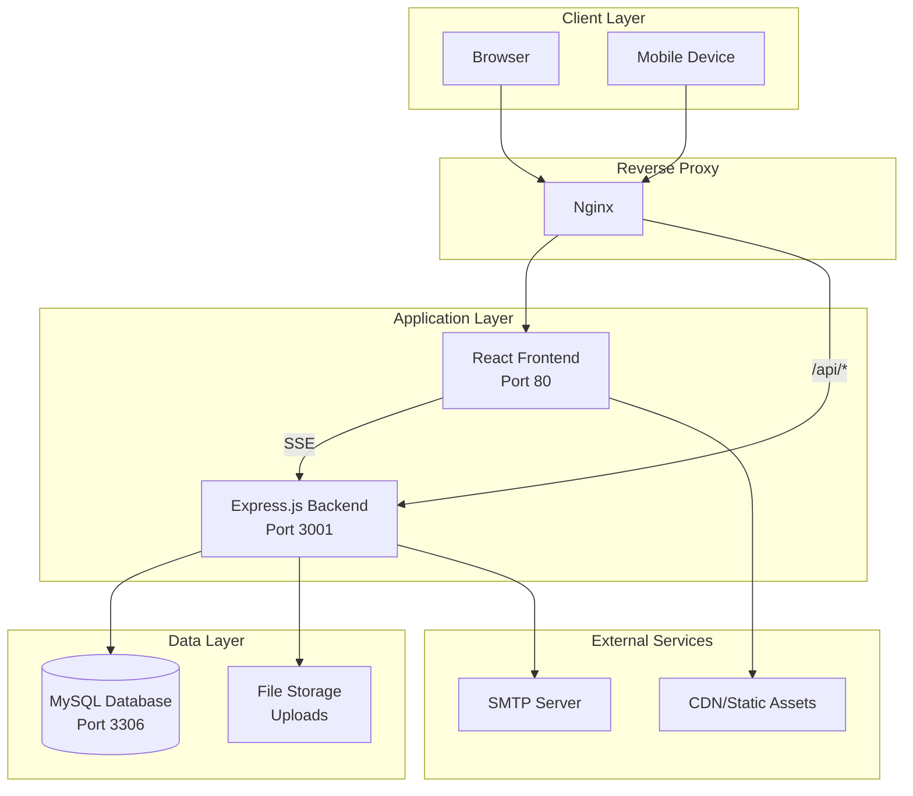
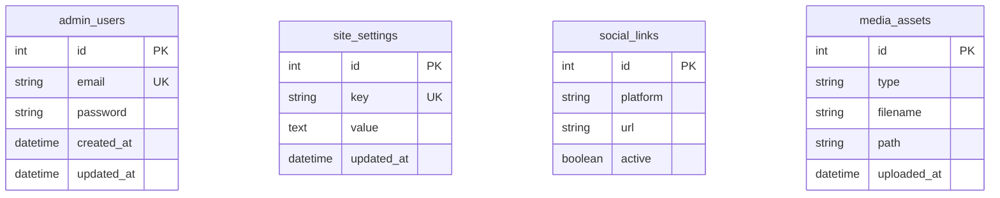
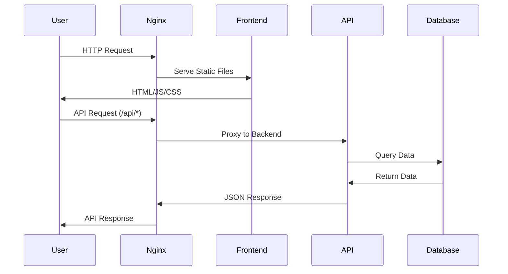
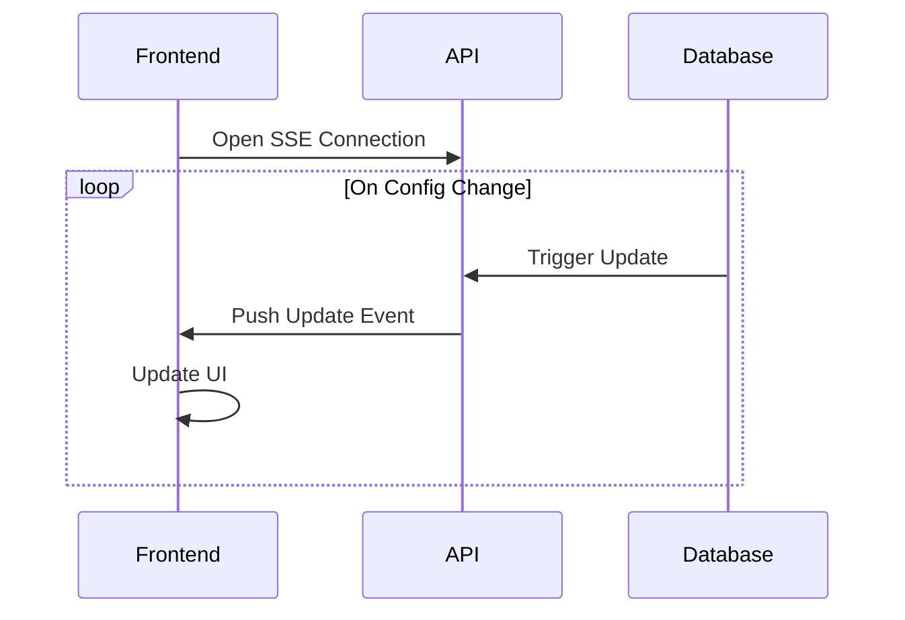
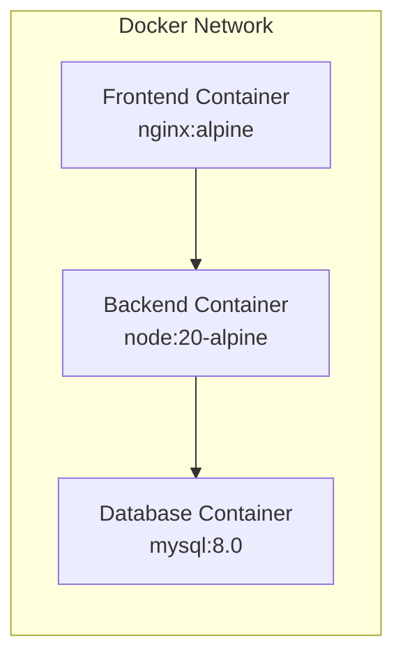

# Novobhumi - System Architecture

## Overview

Novobhumi is a fullstack web application for a premium cocopeat brand, featuring a React frontend and Express.js backend with MySQL database.

## Architecture Diagram

## Component Details

### Frontend (React + TypeScript)

- **Framework**: React 19 with TypeScript
- **Build Tool**: Vite 7
- **Styling**: Tailwind CSS with custom earth-tone palette
- **Animations**: Framer Motion
- **Routing**: React Router v6

#### Key Components

| Component | Description |
|-----------|-------------|
| `Hero` | Landing section with product showcase |
| `Benefits` | 12 key benefits with professional design |
| `Products` | Product catalog with buy buttons |
| `Testimonials` | Customer reviews carousel |
| `Comparison` | Traditional vs Novobhumi comparison |
| `MayurAdmin` | Secret admin panel for content management |

### Backend (Express.js + Prisma)

- **Runtime**: Node.js 20
- **Framework**: Express.js
- **ORM**: Prisma
- **Database**: MySQL 8.0

#### API Endpoints

| Endpoint | Method | Description |
|----------|--------|-------------|
| `/api/health` | GET | Health check |
| `/api/config` | GET | Get site configuration |
| `/api/config` | PUT | Update site configuration |
| `/api/config/stream` | GET | SSE for real-time updates |
| `/api/auth/login` | POST | Admin login |
| `/api/auth/logout` | POST | Admin logout |
| `/api/media/upload` | POST | Upload media files |

### Database Schema

## Data Flow

### User Request Flow

### Real-time Updates (SSE)

## Deployment Architecture

### Docker Containers

### Production Environment

- **Load Balancer**: Optional, for horizontal scaling
- **Nginx**: Reverse proxy with SSL termination
- **Docker Compose**: Container orchestration
- **Volumes**: Persistent storage for database and uploads

## Security Considerations

1. **Authentication**: Session-based with bcrypt password hashing
2. **CORS**: Configured for allowed origins
3. **Input Validation**: Server-side validation for all inputs
4. **SQL Injection**: Protected via Prisma ORM
5. **XSS Prevention**: React's built-in escaping
6. **HTTPS**: SSL/TLS encryption (in production)

## Scalability

### Horizontal Scaling

- Stateless backend allows multiple instances
- Session storage can be moved to Redis
- Database read replicas for read-heavy workloads

### Performance Optimizations

- Multi-stage Docker builds
- Nginx caching for static assets
- Database connection pooling
- CDN for static asset delivery
